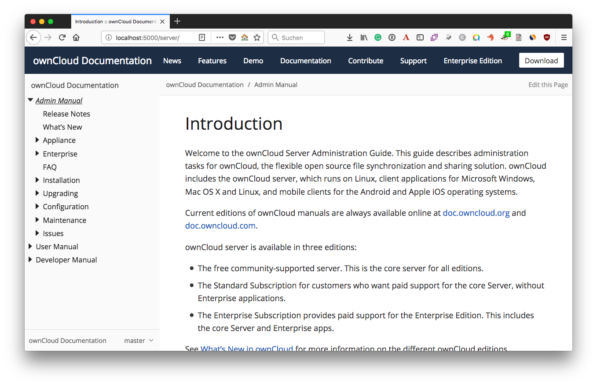

# Contributing to the Docs

You're now ready to work on the new ownCloud docs.
So, let's assume you've made a change to some aspect of the documentation, whether large or small, and you want to see what it looks like.

From the command line, in the root of the docs directory, run the command `antora site.yml`.
If all goes well, you will not see any console output.
However, if an aspect of your change (or one of the other files) contains invalid AsciiDoc, then you'll see output similar to the example below.

```console
asciidoctor: ERROR: index.adoc: line 25: only book doctypes can contain level 0 sections
```

There, you can see that an error was found, the file it was found in, and the line of that file where it is located.
Assuming that there are no errors, the next thing to do is to run the NPM web server so that you can view your changes, before committing and pushing the changes to the remote docs repository.

To do that, run the command `serve public &`.
This starts up the NPM web server, using the public directory, (re)generated by `antora site.yml`, as the document root.
By default, this starts the web server listening on http://localhost:5000 and copy the URL to the clipboard.


Open the URL in your browser of choice, and you'll see two links, as below.


Click "**server/**", and you'll see the local copy of the documentation.



If you're happy with your changes, as with any other change, create a set of meaningful commits and push them to the remote repository.
I hope that you can see that contributing to the documentation using Antora is a pretty straight-forward process, and not _that_ demanding.

